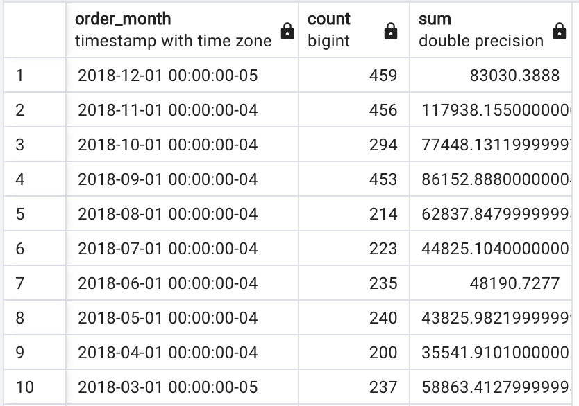
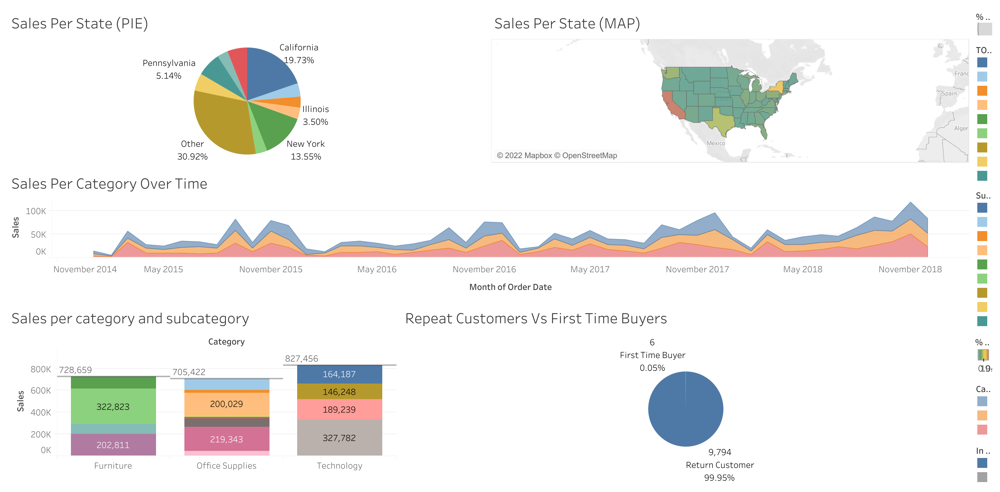

# Retail Sales Analysis

Description: A data analysis project exploring retail sales data using SQL and Tableau. The dataset was first imported into PostgreSQL for cleaning and exploration, then visualized in Tableau.

About the dataset: Dataset obtained from [here](https://www.kaggle.com/datasets/rohitsahoo/sales-forecasting). Contains retail sales data for a superstore spanning 4 years, including fields such as Order Date, Ship Mode, Customer ID, Region, Product Category, Sub-Category, and Sales.

The data was imported into PostgreSQL where it was cleaned and explored through a series of queries. [A direct link to the code and the full process can be found here.](https://github.com/adamsami-62/Sales-Data-Analysis/blob/main/Sales_Data_Analysis.sql)

**Example SQL Analysis**

Query:
```sql
SELECT 
    DATE_TRUNC('month',order_date) AS order_month, COUNT(sale) AS count, SUM(sale)
FROM 
    sales_data
GROUP BY 
    DATE_TRUNC('month',order_date)
ORDER BY 
    DATE_TRUNC('month',order_date) DESC;
```

Output:



After the data had been cleaned and explored it was imported into Tableau for further analysis and visualization. Full results can be found here: [Tableau Dashboard](https://public.tableau.com/views/SalesDataAnalysis_17746506246310/Dashboard1?:language=en-US&:sid=&:redirect=auth&:display_count=n&:origin=viz_share_link)


